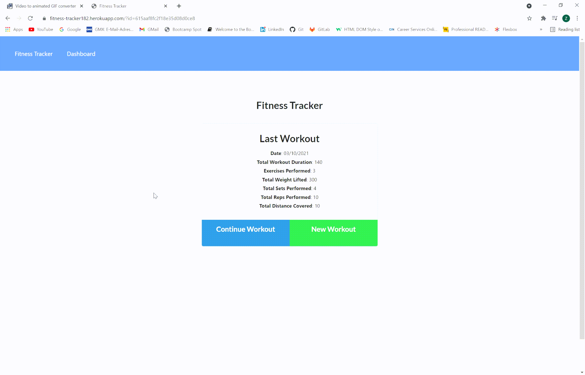

# Fitness-Tracker

    

## General Information
 
* [Deployed Web Application](https://fitness-tracker182.herokuapp.com/?id=615aa25006ece646e03c3d98)
* [GitHub repository of Fitness-Tracker](https://github.com/ZahraMertens/Fitness-Tracker.git)

## Table of Contents
1. [General Information](#general-information)
2. [Task Description](#task-description)
3. [Mock-Up](#mock-up)
4. [Installation Instructions](#installation-instructions)
5. [Technologies Used](#technologies-used)
6. [User Story](#user-story)
7. [Business Context](#business-context)
8. [Usage](#usage)
9. [Credits](#credits)

## Task Description

The Web Application is a Fitness-Tracker/Workout-Tracker which allows a user to create and track workouts in order to be able to monitor his/her activities. The frontend starter code was given but and the routes in order to perform CRUD requests, the schema and server setup were created to connect frontend and backend.

## Mock-Up

🎥 The GIF shows the Landing page and the note page where the user is able to save and delete notes:

## Installation Instructions

* First the user must clone the [GitHub Repo](https://github.com/ZahraMertens/Fitness-Tracker.git) on its OS.

* Open the repository on your device with VS Code (or any other program)

* Open the command line at the folder location OR the integrated terminal 

* First, you MUST install the npm packages by running "npm install" in the terminal

* To initialize the database the user must have mongoDB installed and then run "mongo" and "use workout" in the terminal

* To seed the database, the user must run "node seeders/seed" in the terminal.

* To un the application on your local device the user must run "npm start" in the terminal and will see a link such as "http://localhost:27017" if the user runs the link in the browser the application should run on the local host.

## Technologies Used

* JavaScript

* Node.JS

* Express.JS

* MongoDB

* Dotenv

* Mongoose

* Morgan

* MongoDB Atlas (Cloud)

## User Story

* As a user, I want to be able to view create and track daily workouts. I want to be able to log multiple exercises in a workout on a given day. I should also be able to track the name, type, weight, sets, reps, and duration of exercise. If the exercise is a cardio exercise, I should be able to track my distance traveled.

## Business Context

A consumer will reach their fitness goals more quickly when they track their workout progress.

## Usage

* WHEN I open the application in the browser THEN I am presented with a data summary of the last workout which displays the sum of the exercises criteria such as Date, Total Workout Duration, Exercises Performed, Total Weight Lifted, Total Sets Performed and Total Reps Performed

* WHEN I see the page which summarizes the last workout data THEN I can choose to either create a New Workout Plan or Continue the last workout plan

* WHEN I click on the "new workout" button THEN I can add a new exercise

* WHEN I decide to add a new exercise I can choose from two different exercise types which are cardio and resistance

* WHEN I choose my exercise to be cardio THEN I can enter the name, distance and duration of the exercise

* WHEN I choose my exercise to be resistance THEN I can enter the name, weight, sets, reps and duration of the exercise

* WHEN I insert all values in the input fields THEN I can choose to complete the workout plan and the exercise gets added to the workout and I will be redirected to the page where the workout summary is displayed. I can then see that my new exercise has been added to the workout. If I choose to add an exercise than I stay on the same page in order to be able to add more exercises to the workout and my exercise I have created gets added to the workout plan

* WHEN I click in the Dashboard Navbar element THEN I am taken to a page which shows to graphs. The first graph shows the Workout durations in minutes for the past 7 days and the second graph shows the weight lifted over the past 7 days. 

## Credits

* https://www.mongodb.com/
* https://docs.mongodb.com/manual/tutorial/query-documents/
* https://mongoosejs.com/docs/
* https://mongoosejs.com/docs/api.html#aggregate_Aggregate
* https://docs.mongodb.com/manual/reference/operator/aggregation/addFields/
* https://docs.mongodb.com/manual/reference/operator/aggregation/sum/

© 2021 Zahra Mertens, Fitness-Tracker